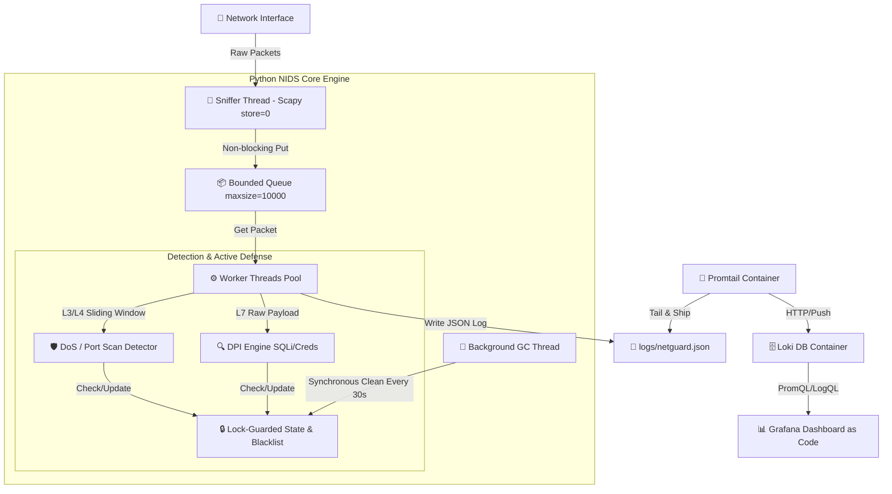

<h1 align="center">🕵️ NetGuard – Full-Stack NIDS & Security Observability Engine</h1>

<p align="center">
  A full end-to-end real-time <strong>Network Intrusion Detection System (NIDS)</strong>.
  <br>
  Combines a Multi-threaded Python (Scapy) capture and analysis engine with <strong>DPI</strong>, Sliding-Window anomaly detection, Active Defense mechanisms, and a fully code-managed monitoring stack (<strong>Dashboard as Code</strong>) on <strong>Docker (Grafana + Loki + Promtail)</strong>.
</p>

<p align="center">
  
  
  
  
  
  
  
</p>

<hr>

<h2 align="center">🔎 Overview & Architecture</h2>
<p align="center">
  <strong>NetGuard</strong> provides a complete solution for monitoring, analyzing, and responding to network security events across OSI layers 3, 4, and 7.
  <br>
  The architecture is built on a continuous Producer-Consumer pipeline that separates low-level packet capture, real-time threat analysis, and structured observability shipping:
</p>



<hr>

<h2 align="left">⚡ Performance & Resilience Analysis</h2>

- **Memory Backpressure & Drop Policy** — The engine utilizes a bounded `Queue(maxsize=10000)` combined with `store=0` in Scapy to ensure zero in-memory packet buffering by the sniffer thread. Under high-throughput conditions, excess packets are dropped safely rather than causing Out-Of-Memory (OOM) fatal crashes.
- **Concurrency & C-Level Unlocking** — Low-level packet capture executes within native socket primitives (C-level libpcap/WinPcap), releasing Python's Global Interpreter Lock (GIL) and allowing the background worker thread and garbage collector thread to execute processing tasks concurrently.
- **Thread Safety & Granular Locking** — Multi-threaded access to volatile state structures (`syn_history`, `port_history`, `blacklist`) is protected using explicit `threading.Lock` primitives to guarantee atomic read/write state transitions without data races.
- **Deterministic Resource Cleanup (Garbage Collector)** — Dormant IP records and expired blacklist entries are purged every 30 seconds by a background garbage collection thread in bounded $O(N)$ time, ensuring steady memory utilization under sustained traffic.

<hr>

<h2 align="center">📂 Project Structure</h2>

```text
python_sniffer/
├── grafana/
│   └── dashboards/                 # Standard JSON Dashboards (Git Version-Controlled)
│       ├── dashboard-Live Security Log Stream.json
│       ├── dashboard-Security Events Distribution.json
│       ├── dashboard-Threat Timeline & Severity Levels.json
│       ├── dashboard-Top Suspicious Source IPs.json
│       └── dashboard-Total Security Alerts.json
├── provisioning/                   # Grafana Automated Provisioning Configs
│   ├── dashboards/
│   │   └── dashboards.yml
│   └── datasources/
│       └── datasources.yml
├── logs/                           # Runtime Log Directory (Ignored by Git)
├── .env.example
├── .gitignore
├── docker-compose.yml
├── main.py                         # NIDS Core Engine (Thread-Safe & GC Refactored)
├── promtail-config.yml
├── requirements.txt
└── test_attack.py                  # Traffic Simulator
```

<hr>

<h2 align="center">🚀 Core Features</h2>

<table align="center">
  <thead>
    <tr>
      <th align="left">Domain</th>
      <th align="left">Feature</th>
      <th align="center">Status</th>
      <th align="left">Description</th>
      <th align="left">Performance Indicator</th>
    </tr>
  </thead>
  <tbody>
    <tr>
      <td align="left">📡 <strong>Network</strong></td>
      <td align="left">Real-time L2-L7 Sniffing</td>
      <td align="center">✅</td>
      <td align="left">Real-time capture and analysis of IP, TCP, UDP, and DNS traffic while preventing memory overflow (<code>store=0</code>).</td>
      <td align="left">Zero-copy capture, O(1) enqueue</td>
    </tr>
    <tr>
      <td align="left">🛡️ <strong>Cyber Security</strong></td>
      <td align="left">Sliding-Window & Stealth Detection</td>
      <td align="center">✅</td>
      <td align="left">Detects <strong>DoS (SYN Flood)</strong>, standard port scans, and <strong>Stealth Scans (NULL, FIN, XMAS)</strong> via moving time windows.</td>
      <td align="left">O(1) queue operations</td>
    </tr>
    <tr>
      <td align="left">🧬 <strong>DNS Security</strong></td>
      <td align="left">DNS Tunneling Detection</td>
      <td align="center">✅</td>
      <td align="left">Shannon Entropy calculation & query length evaluation to catch exfiltration over DNS.</td>
      <td align="left">O(N) entropy check</td>
    </tr>
    <tr>
      <td align="left">⚡ <strong>Active Defense</strong></td>
      <td align="left">Dynamic IP Isolation</td>
      <td align="center">✅</td>
      <td align="left">Active mitigation mechanism that isolates attacking addresses for a limited time (Blacklist with automatic expiry).</td>
      <td align="left">O(1) blacklist check</td>
    </tr>
    <tr>
      <td align="left">🔍 <strong>DPI Engine</strong></td>
      <td align="left">Deep Packet Inspection</td>
      <td align="center">✅</td>
      <td align="left">Byte-level Raw Payload scanning leveraging <strong>Aho-Corasick Automaton</strong> to detect credentials & command injection.</td>
      <td align="left">O(N+M) string matching</td>
    </tr>
    <tr>
      <td align="left">⚙️ <strong>Architecture</strong></td>
      <td align="left">Producer-Consumer & Thread-Safety</td>
      <td align="center">✅</td>
      <td align="left">Bounded <code>Queue</code>, <code>threading.Lock</code> locks, and a dedicated background Garbage Collector thread to prevent memory leaks.</td>
      <td align="left">Bounded queue, backpressure-safe</td>
    </tr>
    <tr>
      <td align="left">📊 <strong>Observability & IaC</strong></td>
      <td align="left">Dashboard as Code (Grafana + Loki)</td>
      <td align="center">✅</td>
      <td align="left">Five pre-defined dashboards in standard JSON format, automatically loaded on container startup via Provisioning files.</td>
      <td align="left">Instant provisioning on boot</td>
    </tr>
    <tr>
      <td align="left">📝 <strong>Logging</strong></td>
      <td align="left">Structured JSON Dual-Stream</td>
      <td align="center">✅</td>
      <td align="left">Colorized console output alongside structured JSON log writes, tailored for collection by Promtail.</td>
      <td align="left">Low-overhead async writes</td>
    </tr>
    <tr>
      <td align="left">🧪 <strong>Testing</strong></td>
      <td align="left">Traffic Attack Simulator</td>
      <td align="center">✅</td>
      <td align="left">Simulation script (<code>test_attack.py</code>) that generates synthetic attack traffic to validate detection mechanisms.</td>
      <td align="left">Configurable synthetic load</td>
    </tr>
  </tbody>
</table>

<hr>

<h2 align="center">🛠️ Technologies & Architectural Highlights</h2>

- **Python & Scapy** — Raw-socket-level packet capture, protocol parsing, and deep payload-level inspection (DPI).
- **Producer-Consumer Architecture** — Full separation between packet capture and analysis via `queue.Queue(maxsize=10000)`, preventing packet loss under load.
- **Thread-Safety & Active Defense** — Whitelist/Blacklist state management and anomaly detection guarded by `threading.Lock` to prevent data races, alongside dynamic, time-limited blocking of attacking IP addresses.
- **Background Garbage Collector** — A dedicated background thread that cleans up stale data structures (Sliding Window History & Blacklist) from memory every 30 seconds, synchronously and thread-safely, ensuring zero memory leaks from dormant IP addresses.
- **Promtail & Grafana Loki** — Shipping of structured JSON logs from the local logs directory and indexing them in Loki.
- **Dashboards as Code (IaC)** — Full version control of 5 dashboards in Git under `grafana/dashboards/`, automatically loaded into Grafana on container startup.
- **Docker Compose Stack** — One-click deployment of the entire observability infrastructure.

<hr>

<h2 align="left">📋 Prerequisites</h2>

- **Docker & Docker Compose** — For running Loki, Promtail, and Grafana.
- **Python 3.10+** — Required for running the NIDS engine and test suite.
- **Administrator / Root Privileges** — Required to capture raw socket traffic via Scapy (or use the least-privilege `setcap` option below on Linux).
- **Npcap (Windows only)** — Required for Scapy to capture raw packets on Windows network adapters.

<hr>

<h2 align="left">📝 JSON Log Structure (Structured Logging)</h2>

```json
{
  "timestamp": "2026-08-06T10:30:15.123456",
  "level": "WARNING",
  "message": "[PORT SCAN DETECTED] Host 10.0.0.4 scanned 18 unique ports",
  "logger": "NetworkGuardian",
  "src_ip": "10.0.0.4",
  "event_type": "PORT_SCAN",
  "details": "18 ports scanned"
}
```

<hr>

<h2 align="left">⚙️ Installation & Quick Start</h2>

```bash
# 1. Clone the repository
git clone https://github.com/RazEini/python_sniffer.git
cd python_sniffer

# 2. Environment Setup
cp .env.example .env  # Set your Grafana password in .env

# 3. Start Observability Stack (Grafana, Loki, Promtail)
# Grafana will automatically provision all dashboards from grafana/dashboards/
docker compose up -d

# 4. Setup Python Environment
python -m venv .venv
.\.venv\Scripts\activate     # On Windows
source .venv/bin/activate    # On Linux/Mac
pip install -r requirements.txt

# 5. Run NIDS Engine
# On Linux (Principle of Least Privilege - grant raw socket capability without full sudo):
sudo setcap cap_net_raw,cap_net_admin=eip $(readlink -f .venv/bin/python)
.venv/bin/python main.py

# Or run directly with root (Linux / Mac):
sudo .venv/bin/python main.py

# On Windows (Run PowerShell / CMD as Administrator):
python main.py

# 6. Run Attack Simulator (in a separate terminal)
# Automatically targets local active IP:
python test_attack.py

# Or target a specific IP address explicitly:
python test_attack.py <TARGET_IP>
```

📊 **Accessing Grafana:** Open your browser to `http://localhost:3000` (username: `admin`, password set in `.env`). All dashboards will already be loaded and ready to use!

<hr>

<h2 align="left">📄 License</h2>
<p align="left">
  This project is distributed under the <strong>MIT</strong> license – free to use and modify for educational and research purposes.
</p>

<hr>

<p align="center"><strong>👨‍💻 Raz Eini (2026)</strong></p>
