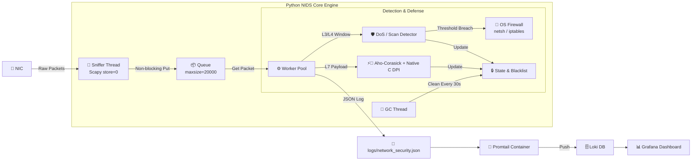

<h1 align="center"> 🕵️ NetGuard – Hybrid Python/C NIDS & Observability Engine </h1>

<p align="center">
  A full end-to-end real-time <strong>Network Intrusion Detection & Prevention System (NIDS/NIPS)</strong>.
  <br>
  Combines a Multi-threaded Python (Scapy) capture and analysis engine with a dual-layer DPI pipeline — an <strong>Aho-Corasick automaton</strong> for keyword signatures and a <strong>Native C Extension</strong> (bounds-checked, called live via <code>ctypes</code>) for injection-pattern signatures — plus Sliding-Window anomaly detection, OS Firewall Active Defense, and a fully code-managed monitoring stack (<strong>Dashboard as Code</strong>) on <strong>Docker (Grafana + Loki + Promtail)</strong>.
</p>

<p align="center">
  
  
  
  
  
  
  
  
</p>

---

## 🔎 Overview & Architecture

**NetGuard** provides a complete solution for monitoring, analyzing, and responding to network security events across OSI layers 3, 4, and 7.
The architecture is built on a continuous Producer-Consumer pipeline that separates low-level packet capture, real-time threat analysis, and structured observability shipping.

> **Architecture Highlight:** NetGuard runs a **dual-layer DPI pipeline** on non-encrypted traffic: an Aho-Corasick automaton for Layer-7 keyword signatures, and a native C Extension (`ctypes`) for injection-pattern detection. Encrypted payloads (e.g., port 443) are automatically bypassed to optimize CPU usage and eliminate false positives.



---

## 📊 Dashboard Preview

Live view of the **NetGuard Security Overview** Grafana dashboard, provisioned automatically from code.

<p align="center">
  
  <br><em>Live JSON log stream with DNS query events, alongside real-time Security Events Distribution and Threat Timeline panels.</em>
</p>

<p align="center">
  
  <br><em>Active Defense in action — a DoS/SYN Flood attack triggers automatic IP isolation, alongside a DNS Tunneling detection alert (Shannon entropy-based).</em>
</p>

<p align="center">
  
  <br><em>Full event-type breakdown (Port Scans, Stealth Scans, DPI Alerts, DoS Attacks) with Top Suspicious Source IPs and Total Security Alerts panels.</em>
</p>

---

## ⚡ Performance & Resilience Analysis

- **Memory Backpressure & Drop Policy** — The engine utilizes a bounded `Queue(maxsize=20000)` combined with `store=0` in Scapy to ensure zero in-memory packet buffering by the sniffer thread. Under high-throughput conditions, excess packets are dropped safely rather than causing Out-Of-Memory (OOM) fatal crashes.
- **Concurrency & C-Level Unlocking** — Low-level packet capture executes within native socket primitives (C-level libpcap/WinPcap), releasing Python's Global Interpreter Lock (GIL) and allowing the background worker thread and garbage collector thread to execute processing tasks concurrently.
- **Thread Safety via a Shared Lock** — Multi-threaded access to volatile state structures (`syn_history`, `port_history`, `blacklist`) is protected by a single shared `threading.Lock` to guarantee atomic read/write state transitions without data races.
- **Active Defense & OS Firewall Integration** — Automatically triggers dynamic OS firewall mitigation rules (`netsh advfirewall` on Windows, `iptables` on Linux) upon identifying DoS/SYN Flood attacks. Commands execute asynchronously in detached daemon threads to keep processing queues zero-latency.
- **Deterministic Resource Cleanup (Garbage Collector)** — Dormant IP records and expired blacklist entries are purged every 30 seconds by a background garbage collection thread in bounded $O(N)$ time, ensuring steady memory utilization under sustained traffic.

---

## 🔬 DPI Engines: Live Detection vs. Throughput Benchmark

NetGuard runs **two DPI engines together** in the live pipeline (`main.py`), each covering a different signature class, plus a separate standalone script for measuring the C engine's raw throughput in isolation:

| | **Live: Aho-Corasick (`_check_dpi_keywords`)** | **Live: Native C (`_check_dpi_native`)** | **Standalone: `benchmark_dpi.py`** |
| :--- | :--- | :--- | :--- |
| Technology | `pyahocorasick` automaton, pure-Python substring fallback if unavailable | Native C via `ctypes`, loaded once in `NetworkGuardian.__init__` | Same `libdpi` shared library, loaded independently |
| Where it runs | Inside `NetworkGuardian._check_dpi`, on every captured packet | Inside `NetworkGuardian._check_dpi`, on every captured packet | Standalone script only — not imported by `main.py` |
| Signature set | `admin`, `password`, `etc/passwd`, `select * from` | `' OR '1'='1`, `UNION SELECT`, `<script>`, `../../`, `etc/passwd`, `cmd.exe`, `; whoami` | Same as the live C engine (fixed in `dpi.c`) |
| Purpose | Real-time keyword/credential-leak alerting | Real-time injection-pattern alerting (SQLi, XSS, path traversal, cmd injection) | Measuring native-C vs. pure-Python throughput on synthetic payloads |
| Required? | Recommended (`pip install pyahocorasick`); falls back to pure Python if missing | Optional — compile with `make -C c_src`; NetGuard runs on Aho-Corasick alone if the shared library isn't present | N/A — dev/benchmarking tool only |

**In short:** the 8x–10x acceleration numbers below are a controlled, isolated measurement of the C engine's throughput on synthetic payloads — they describe the engine's capability, not a claim about end-to-end NIDS throughput (which also includes Scapy capture, queueing, and the Aho-Corasick pass). Build `libdpi` (`make -C c_src`) before running `main.py` to get the C-accelerated injection-signature detection live; without it, NetGuard still runs correctly on Aho-Corasick alone.

---

## 🏎️ DPI Native C Engine Performance

- **Batch Processing & Bounds-Checked Safety** — By eliminating Python FFI execution overhead and passing contiguous memory blocks directly to native C primitives, payload scanning avoids GIL bottlenecks. The engine uses bounds-checked `memchr`/`memcmp` scanning to prevent Out-Of-Bounds reads and Null-Byte truncation issues on raw binary network traffic.
- **Micro-Benchmark Results (100,000 Packets Evaluation)**:

| Engine Implementation | Execution Time | Throughput | Acceleration |
| :--- | :--- | :--- | :--- |
| 🐍 **Python Pure** | `0.3134 sec` | `319,038 Packets/sec` | Baseline (1.0x) |
| ⚡ **Native C Extension (Safe)** | `0.0395 sec` | `2,532,165 Packets/sec` | **7.94x Faster** |

> **Run Benchmark Locally:**
> ```bash
> # Linux / macOS
> make -C c_src
> # Windows (GCC) — requires MinGW/MSYS2 installed
> gcc -shared -O3 -march=native -o libdpi.dll c_src/dpi.c
>
> python benchmark_dpi.py
> ```

---

## 📂 Project Structure

```text
NetGuard/
├── assets/                          # Static Documentation Assets (Dashboard Screenshots)
│   ├── dashboard_overview.png
│   ├── dashboard_threat_detection.png
│   └── dashboard_analytics.png
├── c_src/                          # Low-Level Native C Extensions
│   ├── dpi.c                       # Native C DPI Engine (Batch Engine)
│   └── Makefile                    # C Compilation Setup
├── grafana/
│   ├── dashboards/                 # Standard JSON Dashboard (Git Version-Controlled)
│   │   └── dashboard-NetGuard Security Overview.json
│   └── provisioning/                # Grafana Automated Provisioning Configs
│       ├── dashboards/
│       │   └── dashboards.yml
│       └── datasources/
│           └── datasources.yml
├── logs/                           # Runtime Log Directory (Ignored by Git, not tracked)
├── .env.example
├── .gitignore
├── LICENSE
├── README.md
├── benchmark_dpi.py                # Native C vs Python DPI Micro-Benchmark
├── docker-compose.yml
├── main.py                         # NIDS Core Engine (Thread-Safe & GC Refactored)
├── promtail-config.yml
├── requirements.txt
└── test_attack.py                  # Traffic Simulator
```

---

## 🚀 Core Features

| Domain | Feature | Status | Description | Performance Indicator |
| :--- | :--- | :---: | :--- | :--- |
| 📡 **Network** | Real-time L3-L7 Sniffing | ✅ | Real-time capture and analysis of IP, TCP, UDP, and DNS traffic while preventing memory overflow (`store=0`). | Bounded memory capture (no packet buffering), O(1) enqueue |
| 🛡️ **Cyber Security** | Sliding-Window & Stealth Detection | ✅ | Detects **DoS (SYN Flood)**, standard port scans, and **Stealth Scans (NULL, FIN, XMAS)** via moving time windows. | O(1) queue operations |
| 🧬 **DNS Security** | DNS Tunneling Detection | ✅ | Shannon Entropy calculation & query length evaluation to catch exfiltration over DNS. | O(N) entropy check |
| ⚡ **Active Defense** | Dynamic IP Isolation & OS Firewall | ✅ | Active mitigation mechanism that dynamically injects OS firewall rules (`netsh` / `iptables`) to block malicious hosts upon threshold breach. | Non-blocking async execution, O(1) blacklist check |
| 🔍 **DPI Engine** | Deep Packet Inspection | ✅ | Dual-layer L7 payload scanning: an **Aho-Corasick automaton** for keyword signatures, plus a **Native C Extension** (loaded live via `ctypes`) for bounds-checked injection-pattern signatures. Falls back to Aho-Corasick alone if the C library isn't compiled. | O(N+M) string matching; native C path measured at ~8x throughput vs. pure Python in isolation |
| ⚙️ **Architecture** | Producer-Consumer & Thread-Safety | ✅ | Bounded `Queue`, `threading.Lock` primitives, and a dedicated background Garbage Collector thread to prevent memory leaks. | Bounded queue, backpressure-safe |
| 📊 **Observability & IaC** | Dashboard as Code (Grafana + Loki) | ✅ | A single all-in-one "NetGuard Security Overview" dashboard in standard JSON format, automatically loaded on container startup via Provisioning files. | Instant provisioning on boot |
| 📝 **Logging** | Structured JSON Dual-Stream | ✅ | Colorized console output alongside structured JSON log writes (`logs/network_security.json`), tailored for collection by Promtail. | Low-overhead async writes |
| 🧪 **Testing** | Traffic Attack Simulator | ✅ | Simulation script (`test_attack.py`) that generates synthetic attack traffic to validate detection mechanisms. | Configurable synthetic load |

---

## 🛠️ Technologies & Architectural Highlights

- **Python & Scapy** — Raw-socket-level packet capture, protocol parsing, and deep payload-level inspection (DPI).
- **Aho-Corasick DPI (live)** — Multi-pattern automaton (`pyahocorasick`) used inside `main.py` for real-time keyword/signature matching against packet payloads, with a pure-Python substring fallback when the library is unavailable.
- **Native C Extension (ctypes, live)** — Batch-safe, memory-bounds-checked C DPI engine loaded via `ctypes` in `NetworkGuardian.__init__` and called on every packet's payload in `_check_dpi_native` alongside the Aho-Corasick pass, delivering **8x–10x** measured throughput over pure Python for its signature set. The same shared library is also loaded independently by `benchmark_dpi.py` for isolated throughput measurement. Requires `make -C c_src` first; NetGuard degrades gracefully to Aho-Corasick-only if the compiled library isn't present.
- **Producer-Consumer Architecture** — Full separation between packet capture and analysis via `queue.Queue(maxsize=20000)`, preventing packet loss under load.
- **Thread-Safety & Active Defense** — Whitelist/Blacklist state management guarded by `threading.Lock` to prevent data races, integrated with background dynamic OS Firewall rule injection (`netsh` / `iptables`).
- **Background Garbage Collector** — A dedicated background thread that cleans up stale data structures (Sliding Window History & Blacklist) from memory every 30 seconds, synchronously and thread-safely, ensuring zero memory leaks from dormant IP addresses.
- **Promtail & Grafana Loki** — Shipping of structured JSON logs from the local logs directory and indexing them in Loki.
- **Dashboards as Code (IaC)** — The "NetGuard Security Overview" dashboard is version-controlled in Git under `grafana/dashboards/`, automatically loaded into Grafana on container startup.
- **Docker Compose Stack** — One-click deployment of the entire observability infrastructure.

---

### 🧬 Algorithmic Detection: Shannon Entropy for DNS Tunneling

NetGuard identifies covert communications and data exfiltration over DNS by analyzing the randomness (entropy) of domain query strings. 

Standard domain names exhibit predictable natural-language patterns, whereas encrypted/encoded data streams (e.g., Base64/Hex DNS Tunneling) produce significantly higher entropy scores.

- **Mathematical Model:**
  Calculates Shannon Entropy $H(X)$ over the unique byte/character distribution of each query string:
  $$H(X) = -\sum_{i=1}^{n} P(x_i) \log_2 P(x_i)$$
- **Detection Threshold:** Queries exceeding the configured threshold ($H(X) > 4.2$) alongside anomalous string lengths trigger an immediate **DNS Tunneling Alert** and log entry.

---

## 📋 Prerequisites

- **Git** — Required to clone the repository.
- **Docker & Docker Compose** — For running Loki, Promtail, and Grafana.
- **Python 3.10+** — Required for running the NIDS engine and test suite.
- **GCC / Make** — Required to compile the native C DPI engine shared object (`libdpi.so` on Linux, `libdpi.dylib` on macOS, `libdpi.dll` on Windows). Recommended before running `main.py`, since it's now loaded live for injection-signature detection; also used to run `benchmark_dpi.py`. NetGuard still runs correctly on Aho-Corasick alone if you skip this.
- **`pyahocorasick`** — Optional but recommended for the live DPI engine's full performance; a pure-Python fallback is used automatically if it's not installed.
- **Administrator / Root Privileges** — Required to capture raw socket traffic via Scapy and inject OS Firewall blocking rules (or use the least-privilege `setcap` option below on Linux).
- **Npcap (Windows only)** — Required for Scapy to capture raw packets on Windows network adapters.

---

## 📝 JSON Log Structure (Structured Logging)

```json
{
  "timestamp": "2026-08-06T10:30:15.123456",
  "level": "WARNING",
  "message": "[PORT SCAN DETECTED] Host 10.0.0.4 scanned 18 unique ports",
  "logger": "NetworkGuardian",
  "src_ip": "10.0.0.4",
  "event_type": "PORT_SCAN",
  "details": "18 ports scanned"
}
```

---

## ⚙️ Installation & Quick Start

```bash
# 1. Clone the repository
git clone https://github.com/RazEini/NetGuard.git
cd NetGuard

# 2. Environment Setup
cp .env.example .env  # Set your Grafana password in .env

# 3. Start Observability Stack (Grafana, Loki, Promtail)
# Grafana will automatically provision all dashboards from grafana/dashboards/
docker compose up -d

# 4. Setup Python Environment
python -m venv .venv
.\.venv\Scripts\activate     # On Windows
source .venv/bin/activate    # On Linux/Mac
pip install -r requirements.txt

# 5. Compile the Native C DPI Engine (recommended)
# main.py auto-detects and loads this at startup for live injection-signature
# detection; if you skip this step NetGuard still runs fine on Aho-Corasick alone.
make -C c_src                                                # Linux / macOS
gcc -shared -O3 -march=native -o libdpi.dll c_src/dpi.c      # Windows — requires MinGW/MSYS2 installed

# Optional: run the standalone throughput benchmark (same shared library, isolated measurement)
python benchmark_dpi.py                                      # Verify ~8x memory-safe speedup
```

### 6a. Run NIDS Engine — Linux / macOS

```bash
# Principle of Least Privilege - grant raw socket capability without full sudo:
sudo setcap cap_net_raw,cap_net_admin=eip $(readlink -f .venv/bin/python)
.venv/bin/python main.py

# Or run directly with root:
sudo .venv/bin/python main.py
```

### 6b. Run NIDS Engine — Windows

```powershell
# Run PowerShell / CMD as Administrator:
python main.py
```

### 7. Run Attack Simulator (in a separate terminal)

```bash
# Automatically targets local active IP:
python test_attack.py

# Or target a specific IP address explicitly:
python test_attack.py <TARGET_IP>
```

📊 **Accessing Grafana:** Open your browser to [http://localhost:3000](http://localhost:3000) (username: `admin`, password set in `.env`). All dashboards will already be loaded and ready to use!

---

## 📄 License

This project is distributed under the **MIT** license – free to use and modify for educational and research purposes.

---

<p align="center"><strong>👨‍💻 Raz Eini (2026)</strong></p>
